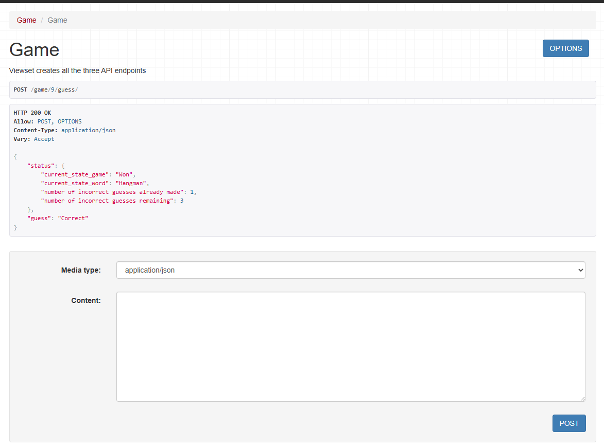

Application
-----------------------
Django Rest Framework based API has been used to power the frontend for a hangman game.
PostgresSQL is used as backend database (sqllite can be used).
* This app exposes an API with the following endpoints. All requests and responses use the JSON data type.  
* Django backend Caching(Redis cache) has been implemeted to improve the performance, reduce latency and
 reduce database connection. The whole gaming logic is handles in the Redis cache.  
* Also, I have followed object oriented programming structure for better
code modularity and reusability.
* Added django logging for production ready and for better troubleshooting.  
* User model is implemented to secure the rest APIs endpoints with JWT cookie based Authentication and
user is able to securly login and play games and logout of the application.

New game
-----------------------
The api/game/new/ endpoint starts a new game. It assigns a random word from the list of following words for the player to guess:
["Hangman", "Python", "Django", "Bottle", "Data"]
The player are allowed to guess incorrectly the number of characters in the word. So for example if the selected word in "Django", 
the player can make 5 incorrect guesses before loosing the game.
This endpoint should return the id of the newly created game object.

Game state
------------------------
The api/game/<:id>/ endpoint accepts a game id and returns a state which contains:
The current state of the game. InProgress , Lost , or Won .

Guess
--------------------------
The api/game/<:id>/guess/ endpoint accepts a single character in JSON format 
{
"guess_letter": "e"
}
and return both the game state as defined in the Game state endpoint and if the guess was correct or not.

Register a user
-----------------------
The api/users/register/ endpoint allow users to register and returns Users data with 200 OK status
